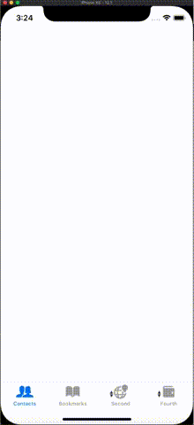

# Popup-TabBar

## Getting Started

- add all files in folder Framework to your project

- you can use this with storyboard and coding

- if you want use with storybaord only change 

[]

### Twitter [@arabphones](https://twitter.com/arabphones)
